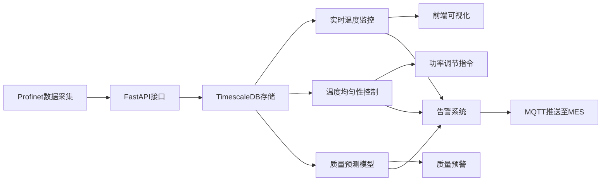

## 1. 产品概述

生物制药冻干机搁板温度均匀性控制与产品质量预测系统，用于实时监控10台冻干机的50层搁板运行状态，通过智能控制算法优化温度均匀性，并基于历史数据预测产品质量。

- **核心价值**：解决冻干过程中温度不均导致的产品质量问题，通过AI预测提前发现不合格品，降低生产损耗
- **目标用户**：生物制药厂生产管理人员、工艺工程师、质量控制人员

## 2. 核心功能

### 2.1 用户角色
| 角色 | 注册方式 | 核心权限 |
|------|----------|----------|
| 生产管理员 | 工号登录 | 查看全部监控数据、告警管理、控制策略配置 |
| 工艺工程师 | 工号登录 | 查看详细数据、调整控制参数、分析质量预测 |
| 质量控制人员 | 工号登录 | 查看质量预测报告、处理质量告警 |

### 2.2 功能模块
1. **实时监控面板**：冻干机概览、搁板温度热力图、真空度动态曲线
2. **温度均匀性控制**：基于模糊控制的加热功率动态调节，目标温差<1℃
3. **产品质量预测**：偏最小二乘回归预测水分含量和复溶时间
4. **告警管理**：温差超限、真空度异常、冷阱温度过高告警，MQTT推送至MES
5. **数据查询分析**：历史数据检索、趋势分析、报表导出

### 2.3 页面详情
| 页面名称 | 模块名称 | 功能描述 |
|----------|----------|----------|
| 监控大屏 | 设备概览 | 10台冻干机运行状态总览，关键指标卡片展示 |
| 监控大屏 | 温度热力图 | Canvas绘制5层搁板温度分布，红框标注不均区域 |
| 监控大屏 | 真空度曲线 | 动态折线图展示各层真空度实时变化 |
| 控制中心 | 功率调节面板 | 显示各加热丝功率及模糊控制输出，支持手动/自动切换 |
| 质量预测 | 预测仪表盘 | 水分含量、复溶时间预测值及置信区间，不合格预警 |
| 告警中心 | 告警列表 | 实时告警展示、历史告警查询、告警处理记录 |

## 3. 核心流程

数据采集流程：Profinet模拟器每10秒生成模拟数据 → FastAPI数据采集接口 → TimescaleDB时序存储 → 实时计算温差 → 模糊控制计算功率调整 → 下发控制指令

质量预测流程：定时抽取干燥速率和温度历史 → 偏最小二乘回归模型预测 → 与质量阈值比对 → 触发不合格预警

## 4. 用户界面设计

### 4.1 设计风格
- **主色调**：工业深蓝 (#0F172A) 作为背景，科技感青色 (#06B6D4) 作为主色
- **告警色**：红色 (#EF4444) 表示严重告警，橙色 (#F59E0B) 表示警告，绿色 (#10B981) 表示正常
- **字体**：标题使用 JetBrains Mono，正文使用 Inter，体现工业科技感
- **布局**：卡片式网格化布局，顶部导航 + 左侧设备列表 + 右侧内容区
- **动效**：数据刷新时采用轻微的数字滚动效果，告警时边框闪烁

### 4.2 页面设计概述
| 页面名称 | 模块名称 | UI元素 |
|----------|----------|---------|
| 监控大屏 | 设备概览 | 10个设备状态卡片，显示当前温度范围、真空度、运行状态 |
| 监控大屏 | 温度热力图 | 5个Canvas热力图并排，悬浮显示具体温度值，红框自动标注温差>1℃区域 |
| 监控大屏 | 真空度曲线 | 动态折线图，支持多曲线叠加，实时滚动更新 |
| 控制中心 | 功率控制面板 | 40个功率指示器（8个/层×5层），滑块可手动调节，自动模式时显示控制输出 |
| 质量预测 | 预测面板 | 仪表盘样式显示预测值，进度条显示置信度，不合格时高亮 |
| 告警中心 | 告警列表 | 时间线式告警记录，支持筛选和确认操作 |

### 4.3 响应性
- **桌面优先**：针对1920×1080及以上分辨率优化，支持多屏展示
- **平板适配**：1024px断点，调整为单列布局，热力图改为竖向排列
- **触控优化**：按钮最小尺寸44px，支持双指缩放查看热力图细节

## 5. 非功能需求

### 5.1 性能要求
- 数据采集延迟 < 100ms
- 前端数据刷新频率 1Hz
- 热力图渲染帧率 > 30fps
- 控制算法响应时间 < 500ms
- 质量预测计算时间 < 2s

### 5.2 可靠性要求
- 系统可用性 > 99.9%
- 数据存储冗余，支持断电恢复
- 告警通知送达率 100%

### 5.3 安全要求
- 所有接口需JWT认证
- 操作日志完整记录
- 敏感数据加密存储
