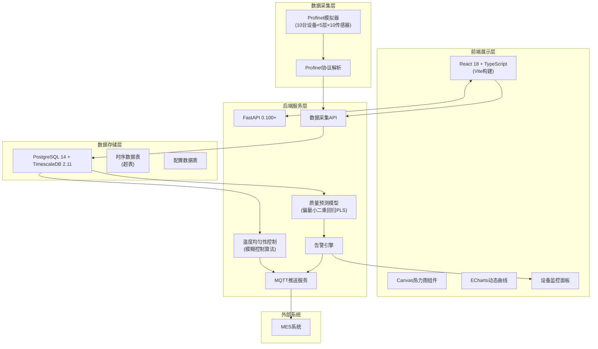
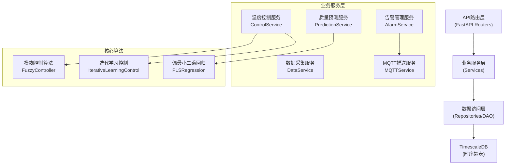

## 1. 架构设计



## 2. 技术栈说明

### 2.1 前端技术栈
- **框架**: React 18 + TypeScript
- **构建工具**: Vite 5.0
- **样式**: TailwindCSS 3.4
- **状态管理**: Zustand 4.4
- **图表库**: ECharts 5.4 (真空度曲线)
- **绘图**: 原生 Canvas 2D (温度热力图)
- **UI组件**: shadcn/ui + Radix UI
- **图标**: lucide-react

### 2.2 后端技术栈
- **Web框架**: FastAPI 0.104+
- **Python版本**: 3.11
- **数据库驱动**: asyncpg 0.29
- **ORM**: SQLAlchemy 2.0 + Alembic
- **时序库**: timescale-vector
- **机器学习**: scikit-learn 1.3 + numpy 1.26 + scipy 1.11
- **MQTT客户端**: paho-mqtt 1.6
- **认证**: python-jose + passlib

### 2.3 数据库
- **主数据库**: PostgreSQL 14
- **时序扩展**: TimescaleDB 2.11
- **消息队列**: Redis 7.2 (可选，用于告警队列)

### 2.4 项目结构
```
/
├── backend/
│   ├── app/
│   │   ├── api/           # API路由
│   │   ├── core/          # 核心配置
│   │   ├── models/        # 数据模型
│   │   ├── services/      # 业务逻辑
│   │   │   ├── control.py    # 模糊控制
│   │   │   ├── prediction.py # PLS预测
│   │   │   └── alarm.py      # 告警引擎
│   │   └── schemas/       # Pydantic模型
│   ├── profinet_simulator.py
│   └── requirements.txt
├── frontend/
│   ├── src/
│   │   ├── components/    # React组件
│   │   │   ├── Heatmap.tsx     # 温度热力图
│   │   │   ├── VacuumChart.tsx # 真空度曲线
│   │   │   └── AlarmPanel.tsx  # 告警面板
│   │   ├── pages/         # 页面
│   │   ├── store/         # Zustand状态
│   │   └── utils/         # 工具函数
│   └── package.json
├── database/
│   └── init_timescaledb.sql
└── README.md
```

## 3. 路由定义

| 路由路径 | 方法 | 用途 |
|---------|------|------|
| `/api/auth/login` | POST | 用户登录获取Token |
| `/api/devices` | GET | 获取所有冻干机列表 |
| `/api/devices/{id}` | GET | 获取单台设备详情 |
| `/api/devices/{id}/shelves` | GET | 获取设备搁板数据 |
| `/api/data/telemetry` | POST | 接收Profinet遥测数据 |
| `/api/data/realtime/{device_id}` | GET | 获取实时数据 |
| `/api/data/history` | GET | 查询历史数据 |
| `/api/control/power` | POST | 下发加热功率控制 |
| `/api/control/mode` | PUT | 切换手动/自动模式 |
| `/api/prediction/quality` | POST | 触发质量预测 |
| `/api/prediction/result/{device_id}` | GET | 获取预测结果 |
| `/api/alarm/current` | GET | 获取当前告警 |
| `/api/alarm/history` | GET | 查询历史告警 |
| `/api/alarm/acknowledge` | POST | 确认告警 |

## 4. API数据模型

### 4.1 遥测数据 (Telemetry)
```typescript
interface TelemetryData {
  device_id: number;           // 设备ID 1-10
  shelf_id: number;            // 搁板ID 1-5
  timestamp: string;           // ISO时间戳
  temperatures: number[];      // 8个温度点 (℃)
  vacuum_levels: number[];     // 2个真空度 (Pa)
  cold_trap_temp: number;      // 冷阱温度 (℃)
  heating_powers: number[];    // 8个加热丝功率 (%)
}
```

### 4.2 控制指令 (ControlCommand)
```typescript
interface ControlCommand {
  device_id: number;
  shelf_id: number;
  timestamp: string;
  power_adjustments: number[]; // 8个功率调整值 (-20~+20)
  auto_mode: boolean;          // 是否自动模式
}
```

### 4.3 质量预测结果 (PredictionResult)
```typescript
interface PredictionResult {
  device_id: number;
  batch_id: string;
  timestamp: string;
  moisture_content: {
    predicted: number;         // 预测水分含量 (%)
    confidence: number;        // 置信度 (0-1)
    threshold: number;         // 合格阈值
    is_qualified: boolean;
  };
  reconstitution_time: {
    predicted: number;         // 预测复溶时间 (s)
    confidence: number;
    threshold: number;
    is_qualified: boolean;
  };
  drying_rate: number;         // 当前干燥速率
}
```

### 4.4 告警信息 (Alarm)
```typescript
interface Alarm {
  id: string;
  timestamp: string;
  device_id: number;
  shelf_id?: number;
  alarm_type: 'temperature_diff' | 'vacuum_abnormal' | 'cold_trap_high' | 'quality_prediction';
  severity: 'warning' | 'critical';
  message: string;
  acknowledged: boolean;
  acknowledged_by?: string;
  acknowledged_at?: string;
}
```

## 5. 服务端架构图



## 6. 数据模型

### 6.1 ER图

```mermaid
erDiagram
    DEVICE ||--o{ SHELF : contains
    SHELF ||--o{ TELEMETRY : generates
    DEVICE ||--o{ CONTROL_COMMAND : receives
    DEVICE ||--o{ PREDICTION_RESULT : produces
    DEVICE ||--o{ ALARM : triggers

    DEVICE {
        int id PK
        string name
        string location
        string status
        datetime created_at
    }

    SHELF {
        int id PK
        int device_id FK
        int shelf_number
        int temp_sensor_count
        int vacuum_sensor_count
    }

    TELEMETRY {
        timestamp PK
        int device_id FK
        int shelf_id FK
        float temp_1 to temp_8
        float vacuum_1 to vacuum_2
        float cold_trap_temp
        float power_1 to power_8
    }

    CONTROL_COMMAND {
        int id PK
        int device_id FK
        int shelf_id FK
        datetime timestamp
        float power_adj_1 to power_adj_8
        boolean auto_mode
    }

    PREDICTION_RESULT {
        int id PK
        int device_id FK
        string batch_id
        datetime timestamp
        float moisture_pred
        float moisture_conf
        float reconstitution_pred
        float reconstitution_conf
        float drying_rate
        boolean is_qualified
    }

    ALARM {
        string id PK
        datetime timestamp
        int device_id FK
        int shelf_id FK
        string alarm_type
        string severity
        string message
        boolean acknowledged
    }
```

### 6.2 DDL语句 (TimescaleDB)

```sql
-- 设备表
CREATE TABLE devices (
    id SERIAL PRIMARY KEY,
    name VARCHAR(50) NOT NULL,
    location VARCHAR(100),
    status VARCHAR(20) DEFAULT 'running',
    created_at TIMESTAMPTZ DEFAULT NOW()
);

-- 搁板表
CREATE TABLE shelves (
    id SERIAL PRIMARY KEY,
    device_id INTEGER REFERENCES devices(id),
    shelf_number INTEGER NOT NULL,
    temp_sensor_count INTEGER DEFAULT 8,
    vacuum_sensor_count INTEGER DEFAULT 2,
    UNIQUE(device_id, shelf_number)
);

-- 遥测数据表 (超表)
CREATE TABLE telemetry (
    timestamp TIMESTAMPTZ NOT NULL,
    device_id INTEGER NOT NULL,
    shelf_id INTEGER NOT NULL,
    temp_1 FLOAT, temp_2 FLOAT, temp_3 FLOAT, temp_4 FLOAT,
    temp_5 FLOAT, temp_6 FLOAT, temp_7 FLOAT, temp_8 FLOAT,
    vacuum_1 FLOAT, vacuum_2 FLOAT,
    cold_trap_temp FLOAT,
    power_1 FLOAT, power_2 FLOAT, power_3 FLOAT, power_4 FLOAT,
    power_5 FLOAT, power_6 FLOAT, power_7 FLOAT, power_8 FLOAT,
    PRIMARY KEY (timestamp, device_id, shelf_id)
);

-- 创建超表
SELECT create_hypertable('telemetry', 'timestamp');

-- 创建索引
CREATE INDEX idx_telemetry_device_time ON telemetry (device_id, timestamp DESC);
CREATE INDEX idx_telemetry_shelf_time ON telemetry (shelf_id, timestamp DESC);

-- 控制指令表
CREATE TABLE control_commands (
    id SERIAL PRIMARY KEY,
    device_id INTEGER REFERENCES devices(id),
    shelf_id INTEGER REFERENCES shelves(id),
    timestamp TIMESTAMPTZ DEFAULT NOW(),
    power_adj_1 FLOAT, power_adj_2 FLOAT, power_adj_3 FLOAT, power_adj_4 FLOAT,
    power_adj_5 FLOAT, power_adj_6 FLOAT, power_adj_7 FLOAT, power_adj_8 FLOAT,
    auto_mode BOOLEAN DEFAULT true
);

-- 预测结果表
CREATE TABLE prediction_results (
    id SERIAL PRIMARY KEY,
    device_id INTEGER REFERENCES devices(id),
    batch_id VARCHAR(50),
    timestamp TIMESTAMPTZ DEFAULT NOW(),
    moisture_pred FLOAT,
    moisture_conf FLOAT,
    moisture_threshold FLOAT DEFAULT 3.0,
    reconstitution_pred FLOAT,
    reconstitution_conf FLOAT,
    reconstitution_threshold FLOAT DEFAULT 120.0,
    drying_rate FLOAT,
    is_qualified BOOLEAN
);

-- 告警表
CREATE TABLE alarms (
    id UUID PRIMARY KEY DEFAULT gen_random_uuid(),
    timestamp TIMESTAMPTZ DEFAULT NOW(),
    device_id INTEGER REFERENCES devices(id),
    shelf_id INTEGER REFERENCES shelves(id),
    alarm_type VARCHAR(30) NOT NULL,
    severity VARCHAR(10) NOT NULL,
    message TEXT NOT NULL,
    acknowledged BOOLEAN DEFAULT false,
    acknowledged_by VARCHAR(50),
    acknowledged_at TIMESTAMPTZ
);

-- 初始化设备数据
INSERT INTO devices (name, location) VALUES
('FD-001', '车间A-1号'), ('FD-002', '车间A-2号'), ('FD-003', '车间A-3号'),
('FD-004', '车间B-1号'), ('FD-005', '车间B-2号'), ('FD-006', '车间B-3号'),
('FD-007', '车间C-1号'), ('FD-008', '车间C-2号'), ('FD-009', '车间C-3号'),
('FD-010', '车间D-1号');

-- 初始化搁板数据
DO $$
DECLARE
    d_id INTEGER;
    s_num INTEGER;
BEGIN
    FOR d_id IN 1..10 LOOP
        FOR s_num IN 1..5 LOOP
            INSERT INTO shelves (device_id, shelf_number) VALUES (d_id, s_num);
        END LOOP;
    END LOOP;
END $$;
```

## 7. 核心算法设计

### 7.1 温度均匀性模糊控制
- **输入变量**: 温度误差 e = T_set - T_actual，温度变化率 de/dt
- **输出变量**: 加热功率调整量 ΔP (-20% ~ +20%)
- **模糊规则**:
  - IF e > 0.5℃ AND de/dt > 0 THEN ΔP = +15%
  - IF e < -0.5℃ AND de/dt < 0 THEN ΔP = -15%
  - IF |e| < 0.3℃ THEN ΔP = 0
  - ... (共25条规则)
- **去模糊化**: 重心法

### 7.2 偏最小二乘回归 (PLS)
- **自变量**: 近2小时温度序列、真空度序列、加热功率序列、干燥速率
- **因变量**: 水分含量、复溶时间
- **主成分数**: 5-7个主成分
- **模型更新**: 每日使用新批次数据增量训练
